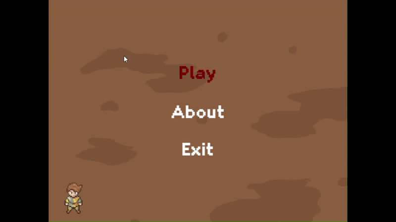
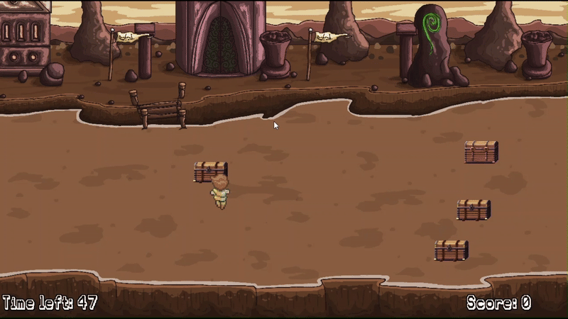
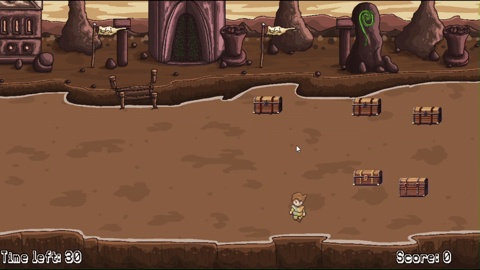
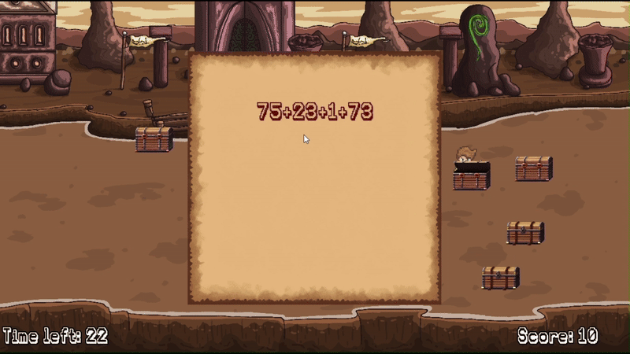
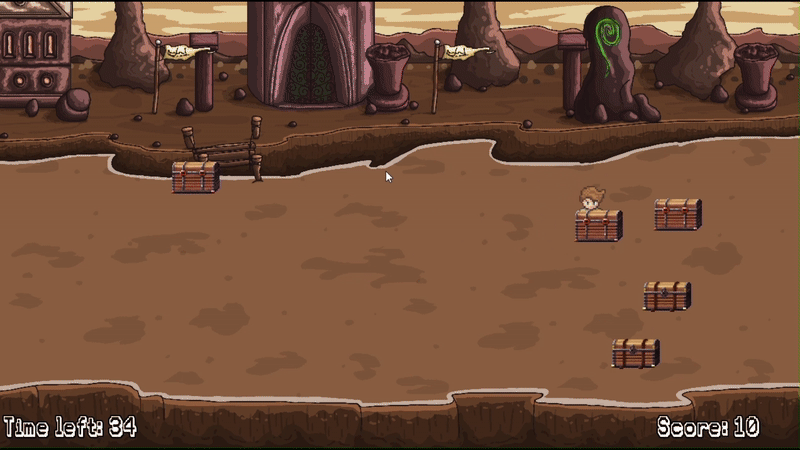
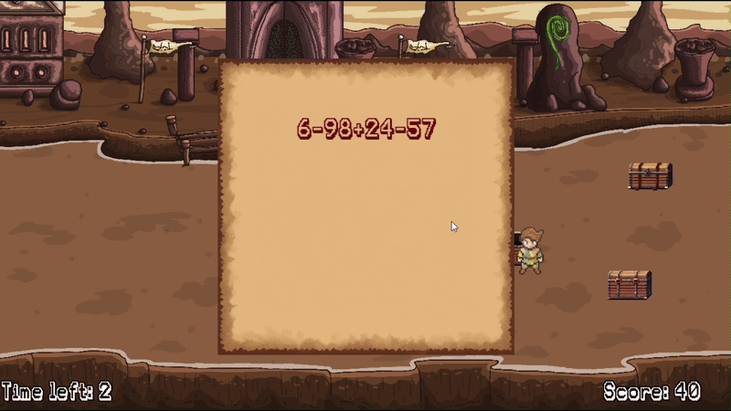

# Math Explorer

░ Put your mind to the test in this **fast‑paced** math adventure! ░  
You have **60 seconds** to open as many chests as you can. Each chest poses a different math problem—rack up points, skip what you don’t know, and see how high you can score!

---

### 🗝️ Chest Types & Spawn Rates

| Chest Type    | Difficulty                   | Spawn Chance | Points per Correct Answer |
| ------------- | -----------------------------|-------------:|--------------------------:|
| **Easy Chest**   | Addition & Subtraction      | 50 %         | 5 pts                     |
| **Medium Chest** | Multiplication & Division   | 30 %         | 10 pts                    |
| **Hard Chest**   | Quadratic Equations         | 20 %         | 15 pts                    |

---

### 🧮 Question Details

- **Easy Chest**  
  Only **+** and **−** operations.

- **Medium Chest**  
  Only **×** and **÷** (all divisions yield whole numbers).

- **Hard Chest**  
  Solve **ax² + bx + c = 0**:
  - If the discriminant Δ < 0 → enter  
    ```
    impossible
    ```  
    (case‑insensitive)
  - If Δ ≥ 0 → enter solutions as  
    ```
    x1,x2
    ```  
    (both are integers, with x₁ < x₂)

---

### 🎮 Controls

| Key           | Action                                                          |
|:-------------:|-----------------------------------------------------------------|
| **W / A / S / D** or **↑ / ← / ↓ / →** | Move your character around the playfield |
| **G**         | Open the next chest question                                    |
| **R**         | Skip current chest (no penalty; timer keeps running)            |


---

### 🏆 Objective

1. **Open** as many chests as possible in 60 seconds.  
2. **Answer** correctly to earn points (5 / 10 / 15).  
3. **Skip** any question you’re unsure of—no penalty, but don’t waste time!  
4. **Compete** with friends and sharpen your mind together.

---

## 🎮 Game Preview

Here are some short GIFs showing different parts of the game:

### Main Menu



### Chest Collision


### Hard Chest


### Correct Answer


### Wrong Answer


### End Game Screen


---

❖ **Good luck** and may your mind be your greatest treasure! ❖  
